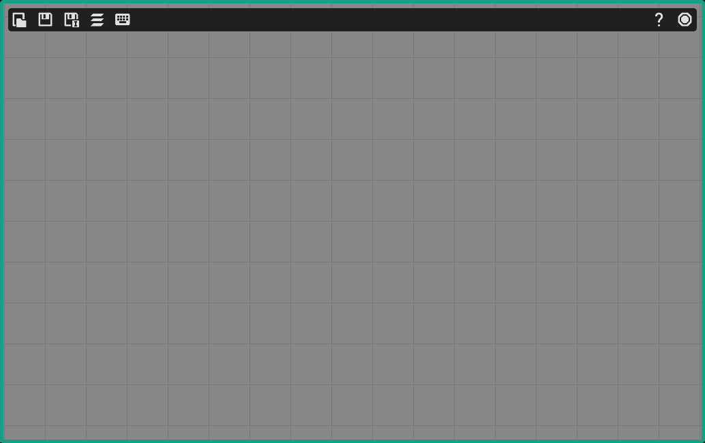

<h1 align="center">OpenPNGStudio</h1>

<p align="center">

</p>
<h3 align="center" style="font-size: 150%;">Create & stream PNGTuber models</h3>



## Overview
OpenPNGStudio is a free (free as in freedom) software for creating and streaming PNGTuber models, offering a rich set of features. The project was created as a free alternative to other PNG tubing software, while also enabling the addition of new features - not found in existing alternatives.

## Features
### Supported Formats
- Supports image formats: `qoi`, `png`, `bmp`, `jpg/jpeg`, `tga`, `psd`, `dds`, and `gif`

### Layer Controls
- Move, rotate, toggle, and set timeouts for layers  
- Activate layers based on:
  - Voice activity: when you are quiet, talking, or pausing
  - Modifier keys: `Shift`, `Ctrl`, `Super (Windows key)`, or `Alt`
  - Regular keys: any from `A–Z`

### Model Management
- Save and load PNGTuber models *(coming soon)*  
- Adjustable background color  
- Switch between `Edit` and `Stream` modes

### Animations
- Assign animations to individual layers or the entire model  
- Trigger animations using the same activation system as layers  
- Configure animation settings to your liking

### Audio & Input *(in progress)*
- Microphone settings *(coming soon)*

## Installation

### Windows
1. Download the latest release from the [Releases page](https://github.com/OpenPNGStudio/OpenPNGStudio/releases).
2. Extract the archive and run `OpenPNGStudio.exe`.

### Linux
#### Precompiled Binaries
1. Download the latest release from the [Releases page](https://github.com/OpenPNGStudio/OpenPNGStudio/releases).
2. Extract the archive, grant executable permissions, and run:
```bash
chmod +x OpenPNGStudio
./OpenPNGStudio
```
#### Building from source
1. Ensure you have `cmake`, `ninja` and `c3c` installed
2. Build
```bash
git clone https://github.com/OpenPNGStudio/OpenPNGStudio.git
cd OpenPNGStudio
./build.sh
```

## Quick Start

1. Launch `OpenPNGStudio`.
2. Add your model's layers.
3. Configure each layer's behavior and triggers.
4. Switch to `Stream` mode using `Tab` - and you’re ready to go live!

> tip: You can change the background color in `Stream` mode to make it match your setup in your streaming software.

## Screenshots
Coming soon.

## Code of Conduct
We value a welcoming and respectful community.  
Please read our [Code of Conduct](CODE_OF_CONDUCT.md) before participating.

## License
OpenPNGStudio is licensed under the **GNU General Public License v3.0 or later (GPL-3.0+)**


